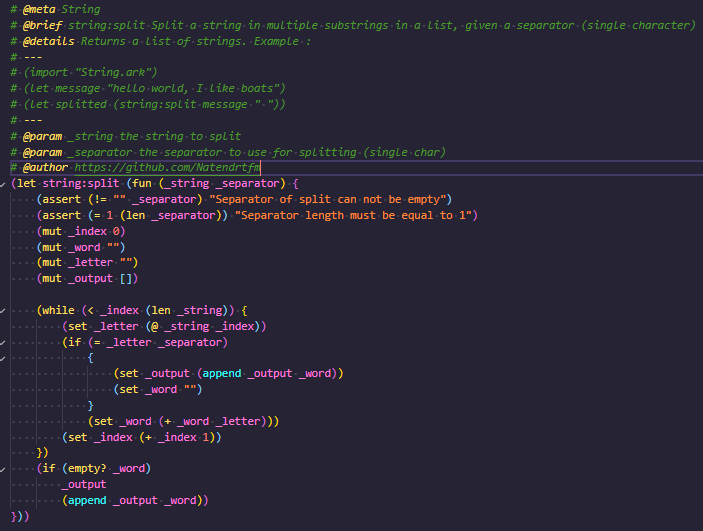

# ArkScript extension

## Features

The extension allows code coloration for the ArkScript programming language.

## Known Issues

If you find any issue, please let me know on GitHub: https://github.com/ArkScript-lang/ArkScript-VSC.

Coloration of user functions doesn't work.